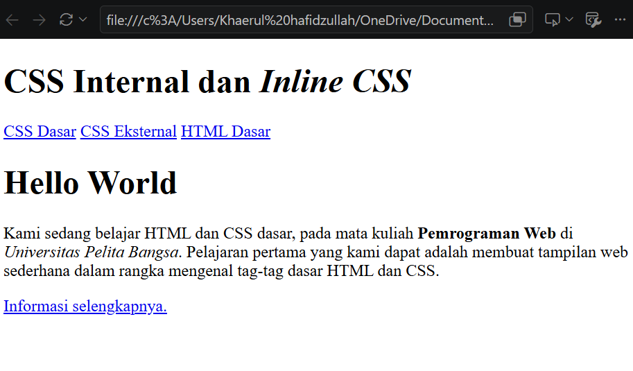
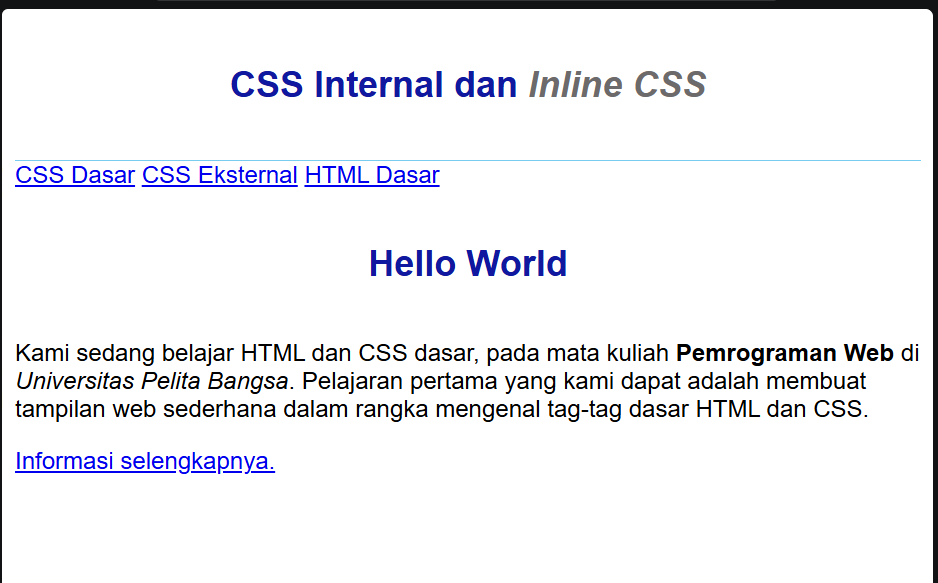
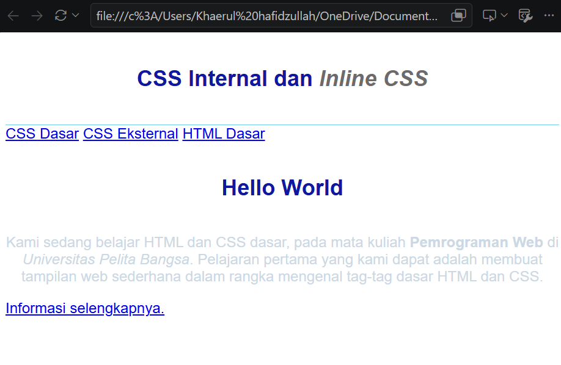
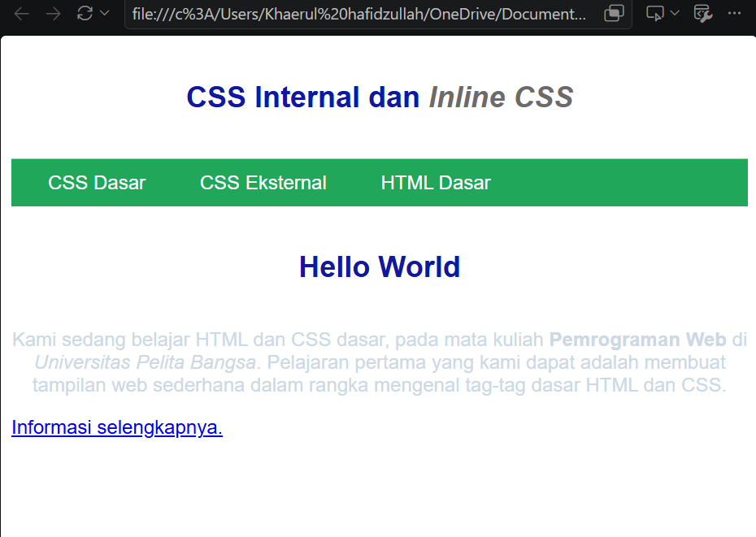
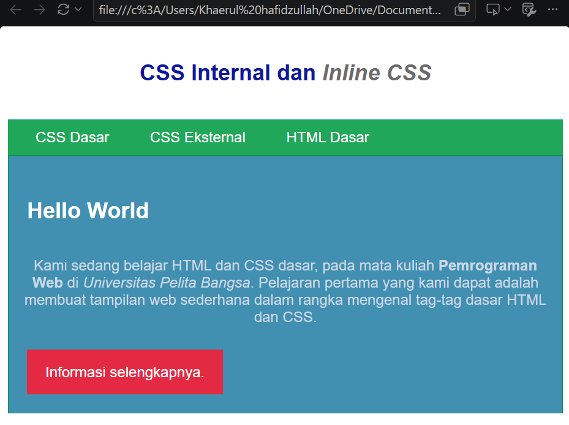

# Laporan Praktikum 3: CSS Dasar
### 1. Membuat Dokumen HTML
Pada langkah pertama, saya membuat file `lab2_css_dasar.html` yang berisi struktur dasar HTML. Di dalamnya terdapat elemen-elemen seperti `<header>`, `<nav>`, `<div>`, `<h1>`, dan `<p>` yang nantinya akan diberikan gaya menggunakan CSS.


### 2. Mendeklarasikan CSS Internal
Saya menambahkan CSS secara internal dengan menyisipkan tag `<style>` di dalam bagian `<head>`. Aturan CSS ini digunakan untuk mengatur jenis font pada `body`, batas bawah pada `header`, serta ukuran, warna, dan posisi teks pada `<h1>`.


### 3. Menambahkan Inline CSS
Pada langkah ini, saya mempraktikkan penulisan CSS langsung di dalam elemen HTML (Inline CSS). Saya menambahkan atribut `style="text-align: center; color: #ccd8e4;"` pada tag `<p>` agar teks paragraf berada di tengah dan warnanya berubah.


### 4. Membuat CSS Eksternal
Saya membuat file baru bernama `style_eksternal.css` khusus untuk mengatur tampilan navigasi (`<nav>`). Kemudian, file CSS eksternal ini dihubungkan ke dalam dokumen HTML menggunakan tag `<link rel="stylesheet" href="style_eksternal.css" type="text/css">` di bagian `<head>`.


### 5. Menambahkan CSS Selector
Terakhir, saya menambahkan aturan CSS baru di dalam file `style_eksternal.css` menggunakan ID Selector dan Class Selector. 
* ID Selector (`#intro`) digunakan untuk mengatur *background* dan garis tepi (border) pada div pembungkus utama.
* Class Selector (`.button` dan `.btn-primary`) digunakan untuk mengubah tampilan tag `<a>` (link) menjadi berbentuk tombol interaktif berwarna merah dengan transisi latar belakang.


Berikut adalah jawaban dan penjelasan lengkap untuk setiap pertanyaan:

**1. Eksperimen Kode CSS**
Untuk bagian eksperimen, Anda bisa mempraktikkan pengubahan properti pada file CSS Anda menggunakan referensi *CSS Cheat Sheet*. Beberapa contoh perubahan yang umum dicoba:

* Mengubah warna teks & latar: `color: #2c3e50;` dan `background-color: #ecf0f1;`
* Mengatur tata letak & jarak: `margin: 20px;`, `padding: 15px;`, dan `border-radius: 8px;`
* Mengubah tipografi: `font-family: 'Segoe UI', sans-serif;` dan `font-size: 18px;`

---

**2. Perbedaan `h1 {...}` dan `#intro h1 {...}**`

* **`h1 {...}` (Type/Element Selector):**
Mengaplikasikan gaya CSS ke **semua** elemen `<h1>` yang ada di seluruh halaman HTML tanpa terkecuali.
* **`#intro h1 {...}` (Descendant Selector):**
Hanya mengaplikasikan gaya CSS ke elemen `<h1>` yang berada **di dalam (di dalam pembungkus/parent)** elemen yang memiliki `id="intro"`. Elemen `<h1>` lain di luar `#intro` tidak akan terkena pengaruh gaya ini.
* **Tingkat Spesifisitas:** `#intro h1` memiliki spesifisitas yang jauh lebih tinggi daripada `h1` biasa karena melibatkan ID selector.

---

**3. Hirarki Prioritas Internal, Eksternal, dan Inline CSS**

Jika sebuah elemen memiliki deklarasi dari CSS Inline, Internal, dan Eksternal secara bersamaan, deklarasi yang akan ditampilkan oleh browser adalah **Inline CSS** (dengan asumsi tidak ada atribut `!important`).

**Urutan Tingkat Prioritas (Cascade):**

1. **Inline CSS** (Prioritas Tertinggi)
2. **Internal CSS & Eksternal CSS** (Memiliki bobot prioritas yang sama; jika aturan spesifisitasnya sama, gaya yang ditulis **paling akhir / paling bawah** dalam dokumen HTML yang akan menang).

**Penjelasan & Contoh:**

```html
<!DOCTYPE html>
<html>
<head>
  <!-- Eksternal CSS -->
  <link rel="stylesheet" href="style.css"> 
  <!-- Isi style.css: p { color: blue; } -->

  <!-- Internal CSS -->
  <style>
    p {
      color: green;
    }
  </style>
</head>
<body>

  <!-- Inline CSS -->
  <p style="color: red;">Teks ini akan berwarna merah.</p>

</body>
</html>

```

* **Hasil pada browser:** Teks akan berwarna **Merah**.
* **Alasan:** Inline CSS diterapkan langsung pada elemen HTML tersebut (`style="..."`), sehingga menimpa (*override*) aturan dari Internal maupun Eksternal CSS.

---

**4. Prioritas Selector ID vs Class (`<p id="paragraf-1" class="text-paragraf">`)**

Apabila suatu elemen HTML memiliki atribut ID dan Class yang masing-masing mendefinisikan properti yang sama, maka deklarasi dari **ID Selector (`#paragraf-1`)** yang akan ditampilkan pada browser.

**Penjelasan:**
Dalam konsep **CSS Specificity** (Spesifisitas CSS), setiap jenis selector memiliki bobot nilai prioritas yang berbeda:

* **ID Selector (`#...`)**: Memiliki nilai spesifisitas **100**.
* **Class Selector (`....`)**: Memiliki nilai spesifisitas **10**.
* **Element Selector (`p`)**: Memiliki nilai spesifisitas **1**.

Karena bobot ID (100) jauh lebih tinggi daripada Class (10), aturan gaya dari ID akan selalu mengalahkan Class.

**Contoh:**

```html
<style>
  /* Spesifisitas = 100 */
  #paragraf-1 {
    color: blue;
    font-weight: bold;
  }

  /* Spesifisitas = 10 */
  .text-paragraf {
    color: red;
  }
</style>

<!-- Elemen HTML -->
<p id="paragraf-1" class="text-paragraf">
  Paragraf ini akan berwarna biru dan tebal.
</p>

```
* **Hasil pada browser:** Teks paragraf akan berwarna **Biru** dan dicetak **Tebal**.
* **Alasan:** Nilai spesifisitas `#paragraf-1` mengalahkan `.text-paragraf`, sehingga `color: blue` yang diterapkan pada teks.